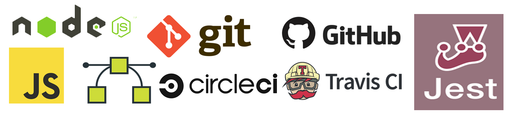

# Blocktron

[](https://github.com/Blocktron-Project/blocktron-node/blob/master/LICENSE)    [](https://snyk.io/test/github/Blocktron-Project/blocktron-node?targetFile=package.json)    [](https://github.com/Blocktron-Project/blocktron-node/issues) [](https://greenkeeper.io/)   

**Blocktron** is a simple yet elegant and efficient **blockchain framework** written in **Javascript** for **Node.js** environment. Blocktron is aimed at developing generic, multipurpose blockchain platforms and softwares for various application use-cases, and also for educational and awareness purposes. This framework is built from the ground up using only **opensource** technologies.
 
# blocktron-node
**blocktron-node** is the single server node of the entire **distributed blocktron system**. A single node of the entire distributed system utilizes the blocktron-lib js blockchain library internally to build the blockchain core data structures and functionalities.

## Motivation
The **blockchain** is an undeniably ingenious invention – the brainchild of a person or group of people known by the pseudonym,  `Satoshi Nakamoto`. But since then, it has evolved into something greater, and the main question every single person is asking is: What is Blockchain? By allowing digital information to be distributed but not copied, blockchain technology created the backbone of a new type of internet. Originally devised for the digital currency, Bitcoin, the tech community is now finding other potential uses for the technology.

As a computer engineer, I am passionate about solving different problems the world is facing today, through softwares, computing and other digital systems, to enhance the world as a better place for humanity. And blockchain has got a lot of attention in the recent years through the rise of certain Dapps platforms and obviously due to the hike in the value of bitcoins. Now the mission of **Blocktron project** is to contribute to that situation by developing blockchain technology to its next level and make it available to the world in its most simple and efficient form, so that the world can make the most of it.

## Build status
This project has been set up with Travis-CI and Circle-CI where the continuous integration and continuous deployment tests are being run on every code commits to ensure code quality and code integrity. These badges shows the tests and builds passing or failing.

- CircleCI -  
- Travis-CI - 

## Technology Stack
Blocktron project is built with the following technologies:
- [JavaScript](https://developer.mozilla.org/bm/docs/Web/JavaScript)
- [Node.js](https://nodejs.org/en/)
- [blocktron-lib](https://www.npmjs.com/package/blocktron-lib)
- [Git](https://git-scm.com/)
- [Github](https://github.com)
- [Travis-CI](https://travis-ci.org)
- [CircleCI](https://circleci.com/)
- [Snyke](https://snyk.io/)
- [Codacy](https://www.codacy.com/)
- [Jest](https://jestjs.io/)



## Why JavaScript & Node.js
**Javascript**, often refered as **js**, is a high level, multi-paradigm, Object-based, event-driven, interpreted programming language. It first appeared in 4th december 1995, 22 years ago. It's also charecterized as dynamic, weakly-typed and prototypal inheritance based language. It was exclusivley created for the web. Its one of the three core technologies which makes the world wide web. Javascript contributes to the interactions on the web pages. Node.js is the opensource, cross-platform javascript runtime environment that can execute javascript code outside the browser environment. It helps developers to build systems for the server side and command line applications using the regular javascript language. Unlike other programming languages Node.js (Javascript) is a lot different. Node.js is a JavaScript runtime built on Chrome’s V8 JavaScript engine. Node.js uses an event-driven, non-blocking I/O model that makes it lightweight and efficient. Node.js’ package ecosystem, npm, is the largest ecosystem of open source libraries in the world. Every browser has a JavaSript engine built in it to process JavaScript files contained in websites. Google Chrome uses V8 engine which is built using C++. 


Node.js also uses this super-fast engine to interpret JavaScript files. Node.js uses an event-driven model. This means that Node.js waits for certain events to take place. It then acts on those events. Events can be anything from a click to a HTTP request. We can also declare our own custom events and make node.js listen for those events. Node.js uses a non-blocking I/O model. We know that I/O tasks take much longer than processing tasks. Node.js uses callback functions to handle such requests. V8 was first designed to increase the performance of JavaScript execution inside web browsers. In order to obtain speed, V8 translates JavaScript code into more efficient machine code instead of using an interpreter. It compiles JavaScript code into machine code at execution by implementing a JIT (Just-In-Time) compiler like a lot of modern JavaScript engines do such as SpiderMonkey or Rhino (Mozilla). The main difference here is that V8 doesn’t produce bytecode or any intermediate code. You can read more about V8 and its internals from the medium post by [sessionstack](https://blog.sessionstack.com/how-javascript-works-inside-the-v8-engine-5-tips-on-how-to-write-optimized-code-ac089e62b12e)

## Getting Started
You can grab a copy of blocktron-node from github either by cloning or downloading the zip. clones can be created using the command:
```sh
git clone https://github.com/Blocktron-Project/blocktron-node.git
```
or using ssh as:
```sh
git clone ssh://git@github.com:Blocktron-Project/blocktron-node.git
```
## Installation
You can install the project dependencies by running the following command inside the project folder:
```sh
npm i
```
**Prerequisites**
This project assumes you have the latest version of the following tools installed in your machine.
* Git
* Node.js >= [v8.x](https://nodejs.org/download/release/latest-v8.x/)
* Python
* Code editor(VS Code or Atom preferably)
* Terminal/cmd

## Dependency
This project is internally dependent on the following npm modules and packages:
- **[blocktron-lib](https://www.npmjs.com/package/blocktron-lib)**
  blocktron-lib module is a member of the Blocktron Project. blocktron-lib is a javascript library housing a blockchain class, and the core blockchain data structures with various blockchain methods and functionalities. This library is fully extensible to accommodate any blockchain applications. Its completely independent and follows a class constructor design pattern and is written using ES6 specifications.
- **[debug](https://www.npmjs.com/package/debug)**
  A tiny JavaScript debugging utility modelled after Node.js core's debugging technique. Works in Node.js and web browsers.
- **[express](https://www.npmjs.com/package/express)**
  Fast, unopinionated, minimalist web framework for node.
- **[http-errors](https://www.npmjs.com/package/http-errors)**
  Create HTTP errors for Express, Koa, Connect, etc. with ease.
- **[path](https://www.npmjs.com/package/path)**
  The path module provides utilities for working with file and directory paths. It can be accessed using:
- **[pino](https://www.npmjs.com/package/pino)**
  Extremely fast node.js logger, inspired by Bunyan. It also includes a shell utility to pretty-print its log files.
- **[request-promise](https://www.npmjs.com/package/request-promise)**
  The simplified HTTP request client 'request' with Promise support. Powered by Bluebird.
- **[serve-favicon](https://www.npmjs.com/package/serve-favicon)**
  Node.js middleware for serving a favicon. A favicon is a visual cue that client software, like browsers, use to identify a site
- **[uuid](https://www.npmjs.com/package/uuid)**
  Simple, fast generation of RFC4122 UUIDS
- **[babel-core](https://www.npmjs.com/package/babel-core)**
  Babel compiler core.
- **[babel-eslint](https://www.npmjs.com/package/babel-eslint)**
  babel-eslint allows you to lint ALL valid Babel code with the fantastic ESLint.
- **[babel-loader](https://www.npmjs.com/package/babel-loader)**
  This package allows transpiling JavaScript files using Babel and webpack.
- **[babel-preset-es2015](https://www.npmjs.com/package/babel-preset-es2015)**
  Babel preset for all es2015 plugins.
- **[babel-preset-stage-0](https://www.npmjs.com/package/babel-preset-stage-0)**
  Babel preset for stage 0 plugins.
- **[eslint](https://www.npmjs.com/package/eslint)**
  ESLint is a tool for identifying and reporting on patterns found in ECMAScript/JavaScript code. In many ways, it is similar to JSLint and JSHint with a few exceptions
- **[jest](https://www.npmjs.com/package/jest)**
  A javascript testing framework from facebook
- **[jsdoc](https://www.npmjs.com/package/jsdoc)**
  An API documentation generator for JavaScript.
- **[prettier](https://www.npmjs.com/package/prettier)**
  Prettier is an opinionated code formatter. It enforces a consistent style by parsing your code and re-printing it with its own rules that take the maximum line length into account, wrapping code when necessary.
- **[prettier-webpack-plugin](https://www.npmjs.com/package/prettier-webpack-plugin)**
  Automatically process your source files with Prettier when bundling via Webpack.
- **[supertest](https://www.npmjs.com/package/supertest)**
  HTTP assertions made easy via superagent.
- **[webpack](https://www.npmjs.com/package/webpack)**
  webpack is a module bundler. Its main purpose is to bundle JavaScript files for usage in a browser, yet it is also capable of transforming, bundling, or packaging just about any resource or asset.
- **[webpack-cli](https://www.npmjs.com/package/webpack-cli)**
  Webpack CLI encapsulates all code related to CLI handling. It captures options and sends them to webpack compiler. You can also find functionality for initializing a project and migrating between versions.

## Changelog
- **v0.0.1**
  - Documentation updates
  - Initial stable blocktron-node build

## API Reference

## Tests
This project follows a **Test Driven Development (TDD)**. Unit tests are written using **Jest**, an opensource testing and code coverage framework from facebook opensource. Test spec files can be found inside the test folder. Tests can be run by the command:
```sh
npm run test
```
> **Note:** This includes code/test coverage report also

## Continuous Integration
Continuous Integration services monitor repositories for changes, then automatically run unit tests on your behalf, typically in a containerized environment. To test this setup works in a continuous integration environment, an integration was done with [Travis CI](https://travis-ci.org/) & [CircleCI](https://circleci.com/). According to the [Travis Node.js Documentation](http://docs.travis-ci.com/user/languages/javascript-with-nodejs/), Travis automatically runs `npm install` and `npm test`. The only additional thing I had to add to the Travis configuration was to run `npm run build` before running the tests. The working Travis config looks like this:

```yml
language: node_js

node_js:
  - stable

install:
  - npm install

script:
  - npm run build-prod
  - npm test
```
Here's the [Travis build page for this project](https://travis-ci.org/Blocktron-Project/blocktron-node), which shows the tests passing.

CircleCI is similar to Travis-CI, but is more extensible and has much more control over the build process. The CircleCI config looks like this:

```yml
# Javascript Node CircleCI 2.0 configuration file
#
# Check https://circleci.com/docs/2.0/language-javascript/ for more details
#
version: 2
jobs:
  build:
    docker:
      # specify the version you desire here
      - image: circleci/node:7.10
      
      # Specify service dependencies here if necessary
      # CircleCI maintains a library of pre-built images
      # documented at https://circleci.com/docs/2.0/circleci-images/
      # - image: circleci/mongo:3.4.4

    working_directory: ~/repo

    steps:
      - checkout

      # Download and cache dependencies
      - restore_cache:
          keys:
          - v1-dependencies-{{ checksum "package.json" }}
          # fallback to using the latest cache if no exact match is found
          - v1-dependencies-

      - run: npm install

      - save_cache:
          paths:
            - node_modules
          key: v1-dependencies-{{ checksum "package.json" }}
        
      # run tests!
      - run: npm run build-dev
      - run: npm run build-prod
      - run: npm test
```

## Contributing
Please read [CONTRIBUTING.md](https://github.com/Blocktron-Project/blocktron-node/blob/master/CONTRIBUTING.md) for details on contributing to the project and [CODE_OF_CONDUCT.md](https://github.com/Blocktron-Project/blocktron-node/blob/master/CODE_OF_CONDUCT.md) for the process for submitting pull requests to us.

## Versioning
We use [SemVer](https://semver.org/) for versioning. For the versions available, see the [tags](https://github.com/Blocktron-Project/blocktron-node/tags) on this repository.

## Authors
* [Sandeep Vattapparambil](https://github.com/SandeepVattapparambil) - Founder, Lead Developer & Maintainer

See also the list of [contributors](https://github.com/Blocktron-Project/blocktron-node/blob/master/AUTHORS.md) who participates in this project.

## License
The MIT License

Copyright (c) 2018- Sandeep Vattapparambil, http://www.sandeepv.in

Permission is hereby granted, free of charge, to any person obtaining a copy of this software and associated documentation files (the "Software"), to deal in the Software without restriction, including without limitation the rights to use, copy, modify, merge, publish, distribute, sublicense, and/or sell copies of the Software, and to permit persons to whom the Software is furnished to do so, subject to the following conditions:

The above copyright notice and this permission notice shall be included in all copies or substantial portions of the Software.

THE SOFTWARE IS PROVIDED "AS IS", WITHOUT WARRANTY OF ANY KIND, EXPRESS OR IMPLIED, INCLUDING BUT NOT LIMITED TO THE WARRANTIES OF MERCHANTABILITY, FITNESS FOR A PARTICULAR PURPOSE AND NONINFRINGEMENT. IN NO EVENT SHALL THE AUTHORS OR COPYRIGHT HOLDERS BE LIABLE FOR ANY CLAIM, DAMAGES OR OTHER LIABILITY, WHETHER IN AN ACTION OF CONTRACT, TORT OR OTHERWISE, ARISING FROM, OUT OF OR IN CONNECTION WITH THE SOFTWARE OR THE USE OR OTHER DEALINGS IN THE SOFTWARE.

## Acknowledgements
Made with ❤️ by Sandeep Vattapparambil.